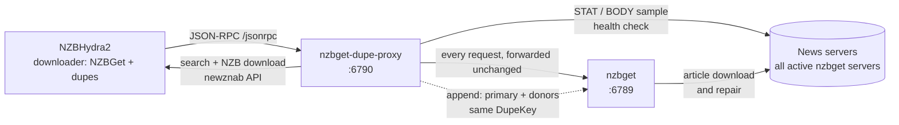
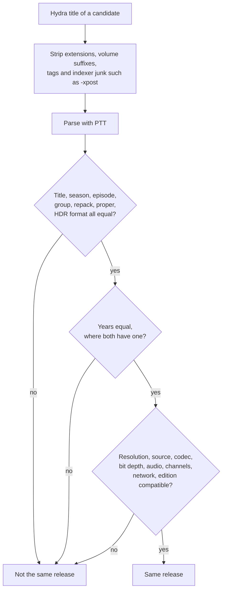
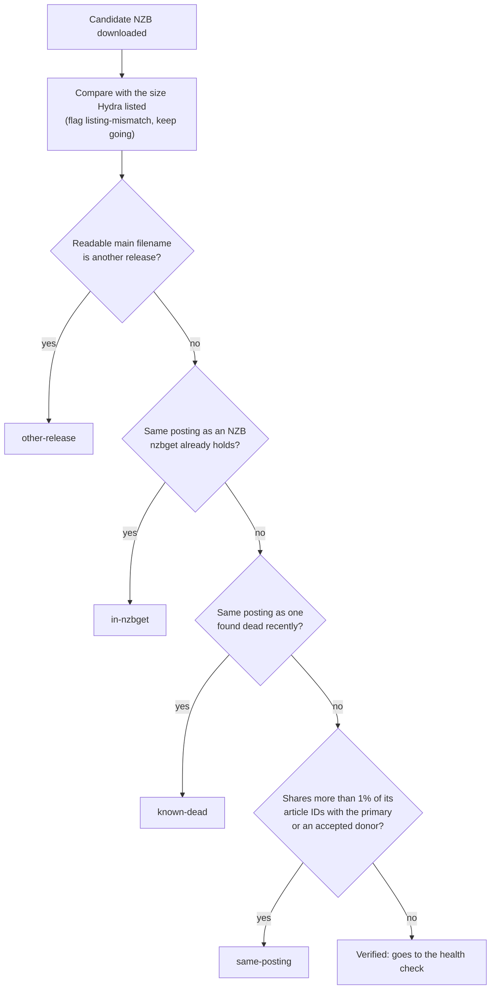
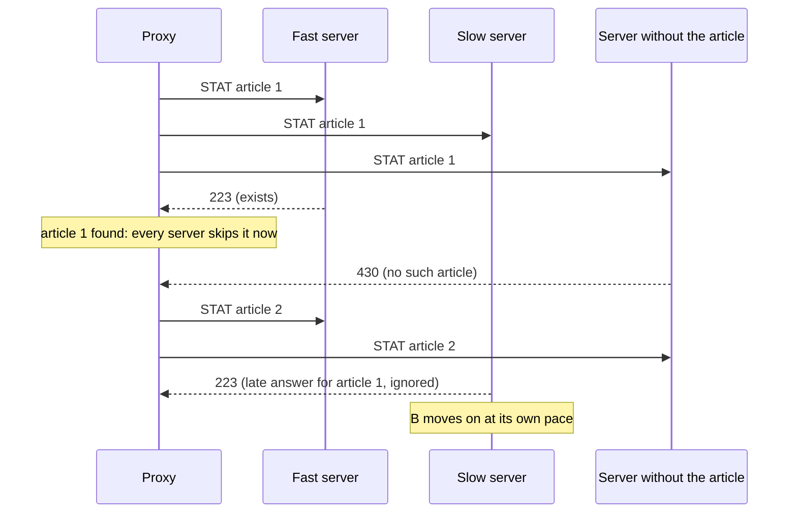
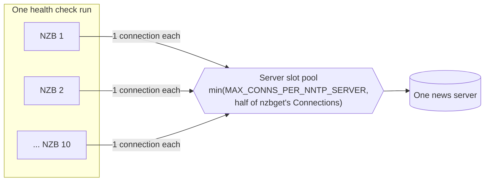
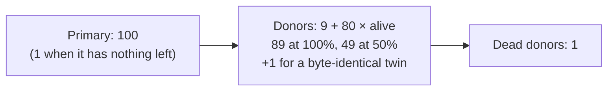
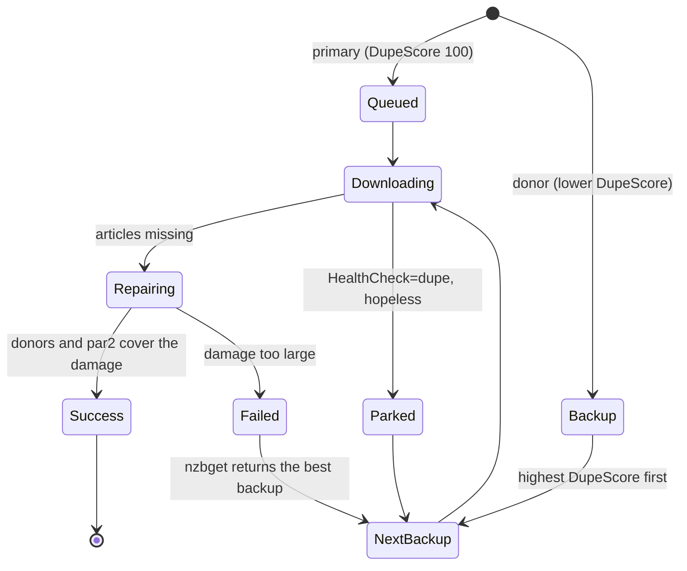

# nzbget-dupe-proxy

nzbget-dupe-proxy sits between [NZBHydra2](https://github.com/theotherp/nzbhydra2) and
[nzbget](https://github.com/nzbgetcom/nzbget). When you send one release from Hydra, the proxy finds every
other posting of that release, checks how much of each posting still exists on your news servers, and
adds the useful ones to nzbget as linked duplicates. nzbget can then repair a damaged download from those
duplicates, or switch to the healthiest one, instead of failing.

The proxy runs as a small Python 3 service with no third-party runtime dependencies. It uses only the
standard library and two vendored pure-Python libraries.

## Contents

- [Why the proxy exists](#why-the-proxy-exists)
- [How it works](#how-it-works)
- [What happens when you send a release](#what-happens-when-you-send-a-release)
- [Finding other postings](#finding-other-postings)
- [Deciding what counts as the same release](#deciding-what-counts-as-the-same-release)
- [Filtering candidates](#filtering-candidates)
- [Checking article health](#checking-article-health)
- [Scoring donors](#scoring-donors)
- [How nzbget uses the donors](#how-nzbget-uses-the-donors)
- [State and repeated grabs](#state-and-repeated-grabs)
- [Requirements](#requirements)
- [Install the proxy](#install-the-proxy)
- [Configure the proxy](#configure-the-proxy)
- [Add the downloader in NZBHydra2](#add-the-downloader-in-nzbhydra2)
- [Read the logs](#read-the-logs)
- [Try discovery without nzbget](#try-discovery-without-nzbget)
- [Results from live use](#results-from-live-use)
- [Troubleshooting](#troubleshooting)
- [Limits](#limits)
- [Develop and test](#develop-and-test)
- [Roll back or uninstall](#roll-back-or-uninstall)
- [Project layout](#project-layout)
- [Credits and licenses](#credits-and-licenses)

## Why the proxy exists

Usenet releases are often posted many times. The same episode can exist as several postings from different
uploaders, each one packaged differently. Takedown notices remove articles from some of those postings and
leave others intact. An indexer usually lists more than one of them, and Hydra often lists 10 or more.

nzbget with [pull request 850](https://github.com/nzbgetcom/nzbget/pull/850) (the `DupeArticleFallback`
feature) can repair a download from duplicates. It does that only with duplicates that it already knows
about: items that share the download's `DupeKey` in its queue or history. Hydra sends nzbget exactly one
NZB and sets no `DupeKey`, so nzbget never learns about the other postings.

The proxy closes that gap:

- It gives the NZB from Hydra a `DupeKey`.
- It finds the other postings through Hydra and adds them under the same `DupeKey`.
- It checks each posting on every news server first, so nzbget only gets donors that are worth using, ranked
  by how much of them still exists.

## How it works

The proxy impersonates nzbget toward Hydra. Hydra sends every request to the proxy, and the proxy forwards
each one to nzbget unchanged. The only call that the proxy changes is `append`, which adds an NZB.



Hydra's connection test, status queries, category list, queue view, and history view all keep working,
because the proxy passes those calls through unchanged.

### What Hydra sends

Hydra 9.0.4 talks to nzbget only through JSON-RPC at `<URL>/jsonrpc`, with HTTP Basic authentication. To add
a release, Hydra calls:

```text
append(NZBFilename, Content, Category, 0, false, AddPaused, "", 0, "SCORE", [])
```

`Content` is the base64-encoded NZB file. Hydra always sends an empty `DupeKey`, a `DupeScore` of `0`, and no
post-processing parameters. The proxy rewrites the `DupeKey`, `DupeScore`, and `DupeMode` fields and passes
the rest through.

## What happens when you send a release

When you click **Send to downloader** in Hydra, the proxy answers Hydra within the normal round trip and
does the rest in the background.

```mermaid
sequenceDiagram
    autonumber
    participant H as NZBHydra2
    participant P as nzbget-dupe-proxy
    participant N as nzbget
    participant S as News servers

    H->>P: append(release.nzb)
    P->>N: append(release.nzb, DupeKey=dupes:release, DupeScore=100)
    N-->>P: NZBID
    P-->>H: NZBID (Hydra is done)
    Note over P: discovery runs in the background
    par Primary check
        P->>S: probe the primary's articles
        S-->>P: present / missing
        opt primary has nothing left
            P->>N: GroupSetDupeScore 1 (demote)
        end
    and Candidate search
        P->>H: search (title, short title, group, IMDb/TVDB)
        H-->>P: up to 500 results per query
        P->>H: download candidate NZBs
    end
    P->>S: probe every candidate (in parallel)
    P->>N: append the 5 best donors (DupeScore 2-90)
    P->>S: full sample of every remaining donor
    P->>N: append each passing donor, rescore the first five
```



The sequence has five parts:

1. **Primary.** The proxy forwards the NZB as the primary download with `DupeKey=dupes:<normalized title>`,
   `DupeScore=100`, and `DupeMode=SCORE`, and returns nzbget's NZBID to Hydra right away. Hydra never waits
   for donor discovery.
1. **Primary check.** In parallel with the search, the proxy checks a small sample of the primary's own
   articles. If none of them exist on any news server, the primary can't download, so the proxy lowers its
   `DupeScore` to `1`. The first healthy donor then outranks it, and nzbget downloads the donor instead.
1. **Search.** The proxy asks Hydra for other postings of the release and downloads each candidate NZB.
1. **Filter.** The proxy drops candidates that are another release, the same posting, already in nzbget, or
   known to be dead. See [Filtering candidates](#filtering-candidates).
1. **Health and append.** The proxy checks a sample of each remaining candidate's articles on every news
   server. It adds the five best candidates right away, then checks the rest more thoroughly and adds each
   one as soon as it passes.

A problem in the background steps never reaches Hydra. If Hydra is down, an indexer refuses a download, or
a news server fails, the primary is already in nzbget and Hydra has already reported success.

## Watching nzbget for other submitters

Some clients send NZBs straight to nzbget, for example nzbdavkodi. With `WATCH_NZBGET=1`, the proxy also
polls nzbget's queue every `WATCH_INTERVAL` seconds (15). It handles a queue item as a new pick when the
item meets all of these conditions:

- The item is not yet past download: its status is `QUEUED`, `PAUSED`, `DOWNLOADING`, or `FETCHING`.
- The item has been in the queue for `WATCH_SETTLE` seconds (20), so its submitter's own backups arrive
  first.
- The item has the top `DupeScore` of its `DupeKey`. Backups and nzbget's failover promotions rank lower.
- The proxy didn't append the item itself.

The proxy reads the pick's NZB from nzbget's `NzbDir` and runs the same discovery as for a Hydra grab,
under the pick's own `DupeKey`. A pick without a `DupeKey` gets one. A pick scored below `PRIMARY_SCORE`
is raised to it. The watcher signs in with `NZBGET_USERNAME` and `NZBGET_PASSWORD`.

In live use, two nzbdavkodi picks of Industry S03 were completely dead. The proxy demoted them within
20 seconds, and nzbget downloaded a live donor or backup instead.

## Finding other postings

The proxy runs several Hydra searches at the same time, because indexers name the same release in
different ways:

| Query | Example for `Lucky.2026.S01E05.2160p.ATVP.WEB-DL.DDPA5.1.HDR.DV.HEVC-FLUX` |
|---|---|
| Full normalized title | `lucky 2026 s01e05 2160p atvp web dl ddpa5 1 hdr dv hevc flux` |
| Short title: name, episode or year, and resolution | `lucky 2026 s01e05 2160p` |
| Short title and release group | `lucky 2026 s01e05 2160p flux` |
| IMDb or TVDB ID, when the NZB includes one | `t=movie&imdbid=…` or `t=tvsearch&tvdbid=…&season=…&ep=…` |

Each query reads up to five pages of 100 results. The group query matters most. Indexers often rename a
release, so the full-title query misses those postings, and a short query that returns 100 results from
other groups can push them off the first page. In one live test, the short query alone found 2 of the 11
postings of a release. The group query and paging found all of them.

Several indexers list the same posting, each with its own link. Listings with the same size and a posting
time within two minutes of each other are one posting, so the proxy downloads one NZB for them and tries the
next listing only when that download fails. A repost of the same files has the same size but a different
posting time, so it stays a separate candidate. Every NZB download counts against the indexer's grab limit.
In one live test, 67 candidates were 17 postings.

The proxy downloads candidate NZBs four postings at a time through Hydra, with at most one download per
indexer at a time. If an indexer answers with an error page instead of an NZB (a rate limit, for example),
the proxy retries once after two seconds. It logs the first part of the reply, so you can see what the
indexer said. An indexer that still answers HTTP 403 or 429 has reached its grab limit, so the proxy skips
it for 30 minutes.

## Deciding what counts as the same release

Sizes can't identify a release. One release can exist as postings that differ by gigabytes, because of
different par2 amounts and packaging. Indexers also report sizes that don't match the NZB they serve. The
proxy compares release names instead, parsed with [PTT](https://github.com/dreulavelle/PTT).



| Attribute | Rule |
|---|---|
| Title, season, episode | Must be equal. |
| Release group | Must be equal. Without a group in the primary's name, the normalized names must be equal. |
| `REPACK`, `PROPER` | Must be equal. A repack is a different encode. |
| HDR format | Must be equal. A missing HDR tag means SDR, so `DV.HDR`, `DV`, and SDR all differ. |
| Year | Must be equal when both names include one. |
| Resolution, source, codec, bit depth, audio, channels, network, edition | Must not conflict. A value that only one name includes is fine, for example `WEB` and `WEB-DL`. |

Size is not a filter by default. If you want a size limit anyway, set `SIZE_TOLERANCE`.

## Filtering candidates

After the proxy downloads a candidate NZB, it runs the NZB through a chain of checks. The first check
that matches decides the outcome, and the summary log line counts each outcome by its key.



| Key | Meaning |
|---|---|
| `relisted` | Another indexer's listing of a posting whose NZB the proxy already has. Not downloaded. |
| `fetch` | Hydra or the indexer refused the NZB download, or the download failed. |
| `refused` | Not downloaded, because the indexer reached its grab limit (HTTP 403 or 429) within the last 30 minutes. |
| `parse` | The reply was not an NZB, for example an indexer error page. |
| `listing-mismatch` | The indexer served an NZB whose size differs by more than 2% from its listing. Some indexers serve another indexer's NZB for a listing. This key flags the NZB but doesn't reject it. |
| `other-release` | The NZB's largest data file has a readable name for a different release, for example 720p inside a 1080p listing. |
| `in-nzbget` | nzbget already holds this posting under the same `DupeKey` or release name, for example from an earlier grab. |
| `known-dead` | The proxy found this posting dead within the last three days. |
| `same-posting` | Another indexer's copy of the primary or of an accepted donor. Donors must point at different articles. |
| `dead` | The health check found too little of the posting on any news server. |
| `over-cap` | More donors passed than `MAX_DONORS` allows. |
| `deadline` | The search or download ran past the discovery deadline. |
| `append` | nzbget refused the donor. |
| `rescore` | nzbget refused a score update for a donor. |

### Identifying a posting

A posting is identified by its Usenet message IDs. Its name and size don't identify it. Two NZBs that share more than 1%
of their message IDs are the same posting. Distinct postings share none.

To recognize postings that nzbget already holds, and postings found dead earlier, the proxy keeps a
compact sketch of each posting: the 64 smallest CRC32 hashes of its message IDs. Two NZBs of the same
posting share most of their sketch, even when an indexer re-lists the posting with a re-uploaded segment.
Distinct postings share almost none. The proxy caches sketches of the NZB files that nzbget keeps in its
`NzbDir`, and reads them while the candidates download.

## Checking article health

An NZB is only a list of message IDs. The proxy checks whether those articles still exist by asking every
active news server in nzbget's configuration. It reads the server list from nzbget's `config` call, with the
credentials that Hydra sends. The proxy never logs server passwords.

### Sampling

| Phase | Articles checked | Purpose |
|---|---|---|
| Probe | 10 articles per NZB | Quickly find postings with nothing left. |
| Full sample | 5% of the articles: from 50 to 1,000 articles | Measure how much of a posting exists. |
| Body check | 20% of the sampled articles, at most 20 per NZB | Download the article body and validate its yEnc data, because a server can answer `STAT` for an article whose data is gone. |

A 2160p episode has about 11,000 articles, so its full sample is about 550 articles. One server downloads
each body article. If its data is missing or corrupt, the next server that has the article tries.

### Asking every server at once

The proxy sends each sampled article to all servers at the same time and settles it with the first real
answer.



- **Present.** One server answers `223` (or delivers valid yEnc data for a body check). The article is
  found, and no server is asked about it again.
- **Missing.** Every server answered and none had the article, with at least one definite `430`. A server
  in its error pause abstains, so it doesn't hold up the verdict.
- **Error.** Every server failed to answer, for example during an outage. Some providers answer `451`
  instead of `430` for a missing article. The proxy counts that as an error vote and keeps the connection.
- **No data.** A server answered `223` but the body was missing or corrupt. That counts as missing.

Each server walks the article list at its own pace, so a slow server never holds up a fast one. A request
that is already in flight for an article that another server found is left to finish. Cancelling it would
mean closing and reopening the connection.

The proxy pipelines `STAT` commands: it sends several on one connection before it reads the answers. A
server starts with 4 per round trip. The number doubles, up to 16, while a batch returns within a second,
and halves when a batch takes more than two seconds. In a live test, 32 `STAT` commands took 1 to 5 seconds
one at a time and 0.1 to 0.5 seconds pipelined on servers limited by network latency. Servers limited by
their own lookup time gain little.

### Connection limits



- The proxy checks `NZBS_TO_CHECK_CONCURRENTLY` (10) NZBs at once. Each one uses
  `NNTP_SERVER_CONNECTION_PER_NZB` (1) connection per server.
- Every open connection holds one slot of its server's pool. A server has at most
  `MAX_CONNS_PER_NNTP_SERVER` (20) slots, and never more than half of the `Connections` value that nzbget uses
  for it, so nzbget's own downloads keep the rest.
- The pool is shared by every grab in progress, so several grabs at once still respect the same cap. When
  another grab is waiting for a slot, an idle connection closes and hands its slot over.
- The proxy closes connections politely with `QUIT` and waits for the server to close the session before it
  reuses the slot, so the server never sees one connection too many.
- A server that fails three times in a row pauses for 30 seconds and is then asked again.

### Budget and verdicts

Each NZB gets its own time budget, `HEALTH_BUDGET` (120 seconds), counted from the start of its check.
When the budget runs out, an unanswered article counts as missing if at least half of the servers said so
and none had it. Otherwise it counts as unknown. An NZB with fewer than five answers is not judged. The
`alive` share of an NZB is the share of its answered articles that exist.

Present articles settle at the first hit, while missing ones wait for every server. Without the half rule,
the articles that are still unanswered at the end of the budget are mostly missing ones. In a live test,
leaving them out made a 12%-alive NZB look 57% alive.

A donor counts as dead only with at least five definite misses: after the probe if none of its articles
exist anywhere, and after the full sample if less than `DONOR_MIN_ALIVE` (50%) of them exist. An outage
alone can't mark a donor dead.

## Scoring donors

nzbget's PR 850 fallback tries donors in `DupeScore` order, and nzbget's normal failover picks the
highest-scored backup. The proxy encodes each donor's measured health into its `DupeScore`, so nzbget tries
the most whole postings first.



| Donor | `DupeScore` | Why |
|---|---|---|
| Primary | `PRIMARY_SCORE` (1,000,000), or a higher score its submitter set | The release you chose. |
| Primary with nothing left on any server | base + 1 | Demoted, so the first healthy donor replaces it in the queue. |
| Donor | base + 9 + 80 × alive | The more of a posting exists, the earlier nzbget tries it. |

The base is the primary's score minus 1,000. nzbget fails over to a backup only if the backup's score is
at least the primary's score × health / 1000. With the primary at 1,000,000, donors pass that check at any
health below 99.9%. Donors also stay below the backups that the submitter scored just under its pick.

The table below and the diagram give scores relative to the base.
| Byte-identical twin of the primary | One more than an equally whole donor | Article borrowing and whole-file recreation work best with an exact twin, so a twin wins a tie. |
| Donor found dead after its full sample | `1` | Kept in nzbget's history, tried last. |

Scores are unique and below 100. Every donor also gets a `DupeAlive` post-processing parameter with its
measured share as an integer from 0 to 100.

The five fast donors are first scored from their 10-article probe. After their full sample, the proxy
corrects their score and `DupeAlive` value in place with `HistorySetDupeScore` and `HistorySetParameter`.
The other donors are added in the order their checks finish. When every check is done, the proxy re-ranks
all donors: by whole percent alive, then twins first, then closest size, then most grabs. Each donor gets a
strictly lower score than the one before it.

### Why a partly alive primary is never demoted

When a higher-scored duplicate replaces a queued item, nzbget moves the queued item to history and deletes
its download directory. That's harmless for a primary with nothing left, and harmful for a partly alive one,
because its downloaded files are what nzbget's repair from duplicates needs. A partly alive primary
therefore stays queued, and its donors become backups.

## How nzbget uses the donors

With `DupeCheck=yes` and `DupeMode=SCORE`, nzbget moves a duplicate with a lower score than the queued item
straight to history as a backup (`DELETED/DUPE`). Those backups are the donors.



nzbget builds with PR 850 use donors at several levels:

| Level | What it does | Log line to look for |
|---|---|---|
| Article fallback | Downloads a missing article from a donor with the same file layout. | `Recovered N of M missing article(s) of FILE from duplicate collections` |
| Stream repair | Copies missing byte ranges from a byte-identical donor file, after verifying the bytes. | `Recovered X MB (N donor article(s)) of FILE from duplicate NAME` |
| Cross-pack repair | Fills a store-mode archive from a differently packaged donor with the same inner file. | `… from duplicate NAME (cross-packing)` |
| Decompress repair | Extracts a compressed donor archive and copies the matching inner file. | `… from duplicate NAME (decompressed)` |
| Whole-file recreation | Recreates a file that received no articles, from a proven byte-identical donor. | `Recreating FILE … from file … of duplicate …` |
| Dupe par scan | Uses par2 blocks from duplicates that were already downloaded (`ParScan=dupe`). | `Found extra N blocks in dupe sources` |
| Failover | Stops a hopeless download early and queues the best backup (`HealthCheck=dupe`). | `Failing over NAME to duplicate NAME` or `Parking NAME: … no better duplicate in history` |

Repair from duplicates works even when the donor arrives late. A donor added after a file completed with no
articles is still used by the post-processing repair pass.

## State and repeated grabs

The proxy keeps a small JSON file, `STATE_DIR/state.json`, so that repeated grabs behave well.

| Entry | Lifetime | Purpose |
|---|---|---|
| Group per `DupeKey` | 30 days | Records which postings went out under the key and their NZBIDs. |
| Grouping window | 10 minutes | Appends of the same release within the window join the existing `DupeKey`. |
| Dead postings | 3 days | Sketches of postings found dead, so a later grab skips them without new checks. |

This covers Hydra's **Send selected** button, which sends each selected row as its own `append`:

- A row of the same release joins the first row's `DupeKey` and doesn't start a second discovery.
- A row whose posting was already sent as a donor gets that donor's existing NZBID back instead of a second
  copy.

## Requirements

- Python 3.10 or later. The proxy needs no third-party Python packages at run time.
- NZBHydra2. The proxy was tested with version 9.0.4.
- nzbget with PR 850 (`DupeArticleFallback`). Without PR 850, nzbget still uses the donors for its normal
  duplicate failover.
- These nzbget settings:

  | Setting | Value | Why |
  |---|---|---|
  | `DupeCheck` | `yes` | Turns donors into backups instead of extra downloads. |
  | `NzbCleanupDisk` | `no` | nzbget re-reads donor NZB files from `NzbDir`. |
  | `KeepHistory` | greater than `0` | Backups live in history. |
  | `DupeArticleFallback` | `live` | Enables the PR 850 repair levels. |
  | `DupeStreamDecompress` | `yes` | Enables decompress repair. |
  | `ParScan` | `dupe` | Uses par2 blocks from duplicates. |
  | `HealthCheck` | `dupe` | Fails over early to a better duplicate. |

- Read access for the service user to nzbget's `NzbDir`, for the `in-nzbget` check.

## Install the proxy

1. Clone the repository on the server that runs nzbget:

   ```bash
   git clone git@github.com:Appz4Fun/submit_dupes_from_nzbhydra2.git
   cd submit_dupes_from_nzbhydra2
   ```

1. Run the installer as root. It copies the proxy to `/opt/nzbget-dupe-proxy`, installs the systemd unit,
   and creates `/etc/nzbget-dupe-proxy.env` from the template if that file doesn't exist yet:

   ```bash
   sudo sh deploy/install.sh
   ```

1. Set your Hydra API key in the configuration file:

   ```bash
   sudoedit /etc/nzbget-dupe-proxy.env
   ```

1. Restart the service and check that it answers like nzbget:

   ```bash
   sudo systemctl restart nzbget-dupe-proxy
   curl -s -u USER:PASSWORD http://127.0.0.1:6790/jsonrpc -d '{"method":"version","params":[]}'
   ```

   The reply shows the same version as nzbget itself.

The service runs as the `nzbget` user, restarts on failure, and starts after `nzbget.service`. It keeps its
state in `/var/lib/nzbget-dupe-proxy`.

## Configure the proxy

The proxy reads its settings from environment variables. The systemd unit loads them from
`/etc/nzbget-dupe-proxy.env`, which is owned by root with mode `600`. `.env.example` lists every variable.

### Connection settings

| Variable | Default | Meaning |
|---|---|---|
| `LISTEN_PORT` | `6790` | Port that the proxy listens on, on all interfaces. |
| `NZBGET_URL` | `http://127.0.0.1:6789` | Address of nzbget. |
| `HYDRA_URL` | none | Address of NZBHydra2, for example `http://127.0.0.1:5076`. |
| `HYDRA_APIKEY` | none | Hydra API key. |
| `STATE_DIR` | `/var/lib/nzbget-dupe-proxy` | Location of `state.json`. |
| `ENABLED` | `true` | `false` turns the proxy into a pure pass-through. |
| `DRY_RUN` | `0` | `1` runs discovery and logs the donors without adding them. The primary is still added. You can also start the proxy with `--dry-run`. |

The proxy uses the credentials that Hydra sends for its own calls to nzbget, so it needs no nzbget password.

### Donor settings

| Variable | Default | Meaning |
|---|---|---|
| `MAX_DONORS` | `0` | Maximum donors per release. `0` or `-1` means no limit. With a limit `N`, the proxy downloads at most `3N` candidate NZBs, because every download counts against your indexer limits. |
| `SIZE_TOLERANCE` | `0` | `0` turns the size filter off. `0.2` skips Hydra results more than 20% larger or smaller than the primary. |
| `FAST_DONORS` | `5` | Donors added right after the probe. The rest are added one at a time after their full sample. |
| `DEADLINE` | `60` | Seconds after the primary append for searching and downloading candidates. |
| `TIMEOUT` | `30` | Seconds per HTTP request to Hydra or an indexer, and per news server command. |

### Health check settings

| Variable | Default | Meaning |
|---|---|---|
| `PRIMARY_SCORE` | `1000000` | `DupeScore` of a primary that the proxy manages. |
| `WATCH_NZBGET` | `0` | `1` also watches nzbget's queue for picks that other clients submit. |
| `WATCH_INTERVAL` | `15` | Seconds between queue polls. |
| `WATCH_SETTLE` | `20` | Seconds a new pick waits before discovery. |
| `NZBGET_USERNAME`, `NZBGET_PASSWORD` | empty | nzbget login for the watcher. |
| `HEALTH_PERCENT` | `5` | Share of each NZB's articles to check. `0` turns health checks off. |
| `HEALTH_MIN_ARTICLES` | `50` | Fewest articles to check per NZB. |
| `HEALTH_MAX_ARTICLES` | `1000` | Most articles to check per NZB. |
| `DONOR_MIN_ALIVE` | `0.5` | Minimum share of a donor's sampled articles that must exist. |
| `HEALTH_BUDGET` | `120` | Seconds per NZB for its checks. |
| `NZBS_TO_CHECK_CONCURRENTLY` | `10` | NZBs checked at the same time. |
| `NNTP_SERVER_CONNECTION_PER_NZB` | `1` | Connections per news server for each NZB being checked. |
| `MAX_CONNS_PER_NNTP_SERVER` | `20` | Maximum connections per news server, also limited to half of that server's nzbget `Connections`. |
| `BODY_PERCENT` | `20` | Share of the sampled articles that also get a `BODY` check. |
| `BODY_MAX_PER_NZB` | `20` | Maximum body checks per NZB. Each check downloads one article, about 750 KB. |

## Add the downloader in NZBHydra2

Keep your existing NZBGet downloader. You add a second one that points at the proxy, so you can choose
per release whether to use the proxy.

1. In Hydra, go to **Config > Downloading**.
1. Click **Add new downloader** and select **NZBGet**.
1. Enter these values:
   - **Name:** `NZBGet + dupes`
   - **URL:** `http://SERVER_IP:6790`
   - **Username** and **Password:** the same as your existing NZBGet downloader.
   - **NZB adding type:** select **Upload**. Hydra must upload the NZB content. In link mode, the proxy only
     sets the `DupeKey`.
1. Click **Test connection**, then click **Save**.

To send a release with donors, choose **NZBGet + dupes** when you send it. To send it without donors,
choose **NZBGet**.

## Read the logs

The proxy logs to journald:

```bash
journalctl -u nzbget-dupe-proxy -f
```

Every `append` ends with one summary line:

```text
append key=dupes:dark.matter.2024.s02e05... nzbid=2211 title=Dark.Matter.2024.S02E05...-FLUX results=1017
candidates=42 verified=6 added=6 rejected={'in-nzbget': 3, 'fetch': 12, 'listing-mismatch': 8,
'same-posting': 21} time=155.7s
```

| Field | Meaning |
|---|---|
| `results` | Hydra results across all queries and pages. |
| `candidates` | Results that are the same release. |
| `verified` | Distinct postings that passed the filter chain. |
| `added` | Donors added to nzbget. |
| `rejected` | Count per [filter key](#filtering-candidates). |
| `time` | Seconds since the primary append. |

Other lines tell the rest of the story:

| Line | Meaning |
|---|---|
| `added donor nzbid=N score=S TITLE [INDEXER, F files, B bytes, grabs=G, alive=A%] (fast)` | A donor added after its probe. |
| `… (checked)` | A donor added after its full sample. |
| `rescored donor nzbid=N …: score 54 -> 86, alive=95% (full sample)` | A fast donor's score corrected after its full sample. |
| `dropping dead donor TITLE [INDEXER] after probe: alive=0% (10 of 10 answered articles on no server, 0 errors)` | A posting with nothing left. |
| `TITLE: primary is dead (…): DupeScore 100 -> 1, the healthiest donor takes over` | The primary was demoted. |
| `INDEXER served a different NZB than it lists for TITLE` | The indexer's NZB doesn't match its listing. |
| `donor parse failed TITLE (INDEXER), attempt 1: not an NZB: '<error code="300" …'` | The indexer sent an error page instead of an NZB. |

nzbget's own repair messages appear in each item's log in the nzbget web interface, or through the
`loadlog` JSON-RPC call. With `WriteLog=none`, nzbget doesn't send informational messages to journald.

## Try discovery without nzbget

`tools/replay_append.py` sends exactly the `append` that Hydra would send to a proxy in dry-run mode, which
runs in the same process as the tool and talks to a fake nzbget. It prints the donors that the proxy would
add. Your real nzbget isn't contacted.

```bash
python3 tools/replay_append.py --title "Lucifer S02E14 1080p" --pick "FraMeSToR @Zurg"
```

`--pick` is a regular expression matched against `TITLE @INDEXER`, and selects the primary. The most-grabbed
match wins. The tool reads `HYDRA_URL` and `HYDRA_APIKEY` from the environment or from `./.env`.

## Results from live use

These results come from production use with nzbget PR 850 builds:

| Release | What happened |
|---|---|
| Dark Matter S02E05 (FLUX) | par2 couldn't repair the download (`1 block(s) needed, but 0` available). nzbget recovered 13.0 MB from a proxy donor with stream repair, and the download succeeded. |
| Sugar S01E07 (FLUX) | The most-grabbed posting was 0% alive. nzbget parked it after 97 seconds and downloaded the healthiest donor, which succeeded. |
| Lucky S01E05 (FLUX) | Hydra listed 11 postings. The proxy found them all, dropped the dead ones, and the top-scored donor (100% alive) downloaded with no failed articles. |
| Lucky S01E04 (FLUX) | The posting sent from Hydra was 0% alive. nzbget failed over to a proxy donor, which succeeded. |

## Troubleshooting

**Hydra reports an error when it sends a release.**
The proxy forwards nzbget's own reply for the primary, so check nzbget first. If nzbget is unreachable, the
proxy answers with HTTP 502.

**The summary shows many `fetch` rejections.**
Indexers refuse NZB downloads when you reach your daily grab limit, usually with HTTP 403. Each candidate
download counts as a grab. The proxy downloads one NZB per posting and skips an indexer for 30 minutes after
it refuses, which shows as `refused`. Set `MAX_DONORS` to limit downloads further.

**The summary shows `listing-mismatch`.**
Some indexers serve another indexer's NZB for a listing. The proxy deduplicates by message ID, so those NZBs
can't be added twice. The posting from the listing itself can't be reached through that link.

**nzbget skips a donor as `DELETED/COPY`.**
nzbget found a history item with exactly the same content. The `in-nzbget` check prevents this for postings
that nzbget holds under the same `DupeKey` or release name.

**Re-sending a failed release does nothing in nzbget.**
nzbget skips an NZB whose content matches a history item (`Skipping duplicate … with exactly same content`).
The proxy still runs discovery for the re-send and adds any new donors.

**The health check seems slow.**
Slow servers answer `430` slowly. A posting with nothing left takes longest, because every server must say
no. The check uses at most half of each server's nzbget `Connections`, so with `Connections=2` it has one
connection per server for every NZB. Raise nzbget's connections, or `NZBS_TO_CHECK_CONCURRENTLY`, within
your providers' limits.

**A provider refuses connections during checks.**
Lower `MAX_CONNS_PER_NNTP_SERVER`. Several nzbget servers that share one provider account also share that
account's connection limit.

## Limits

- The proxy identifies a release by its name. A posting that an indexer lists under a renamed or obfuscated
  title can't be matched, because Hydra's title is the only information available before the download.
- Health checks sample articles. A small share of missing articles can go unnoticed, and nzbget's repair
  covers those.
- Body checks download real article data: up to 20 articles, about 15 MB, per NZB by default.
- The proxy only adds donors. It never deletes anything from nzbget.

## Develop and test

The repository includes 129 tests that run against fakes of nzbget (JSON-RPC), NZBHydra2 (newznab XML and
NZB downloads), and NNTP news servers (`STAT`, `BODY`, authentication, delays, and connection counting).

```bash
python3 -m venv .venv
.venv/bin/pip install pytest
.venv/bin/pytest -q
```

Project rules for contributors are in [AGENTS.md](AGENTS.md). The most important ones:

- Write the failing test first.
- Keep the runtime free of third-party dependencies, except the vendored code under `vendor/`.
- Never commit secrets. `.env` is ignored by git.
- Author and sign every commit as xbmc4lyfe.

## Roll back or uninstall

To stop using the proxy, turn off the service and delete the **NZBGet + dupes** downloader in Hydra:

```bash
sudo systemctl disable --now nzbget-dupe-proxy
```

To make the proxy a pure pass-through instead, set `ENABLED=false` and restart the service.

To remove it completely:

```bash
sudo rm -rf /opt/nzbget-dupe-proxy /etc/systemd/system/nzbget-dupe-proxy.service \
  /etc/nzbget-dupe-proxy.env /var/lib/nzbget-dupe-proxy
sudo systemctl daemon-reload
```

## Project layout

| Path | Contents |
|---|---|
| `nzbget_dupe_proxy.py` | The proxy: pass-through, `append` handling, search, filtering, scoring, state. |
| `donor_health.py` | The parallel article health check on every news server. |
| `vendor/ptt/` | PTT, the release-name parser. |
| `vendor/cyclops/` | cyclops, an asynchronous NNTP client that also validates yEnc data. |
| `deploy/` | systemd unit and installer. |
| `tools/replay_append.py` | Dry-run replay of a Hydra `append`. |
| `tests/` | Tests and the fakes they use. |
| `PLAN.md` | Design notes and findings from the original build. |
| `.env.example` | Every configuration variable. |

## Credits and licenses

- [PTT](https://github.com/dreulavelle/PTT) by Spoked, MIT license, vendored in `vendor/ptt/` with its
  license file.
- [cyclops](https://github.com/Appz4Fun/cyclops), vendored unchanged in `vendor/cyclops/`.
- nzbget's `DupeArticleFallback` is [pull request 850](https://github.com/nzbgetcom/nzbget/pull/850).
